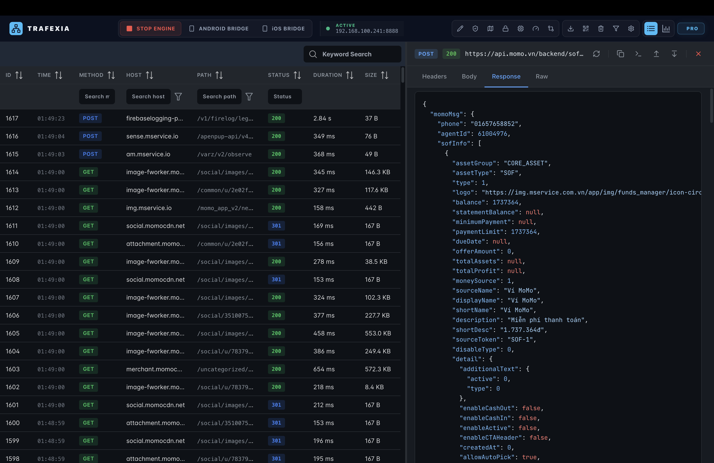
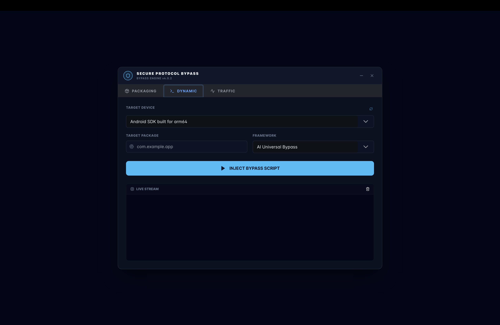
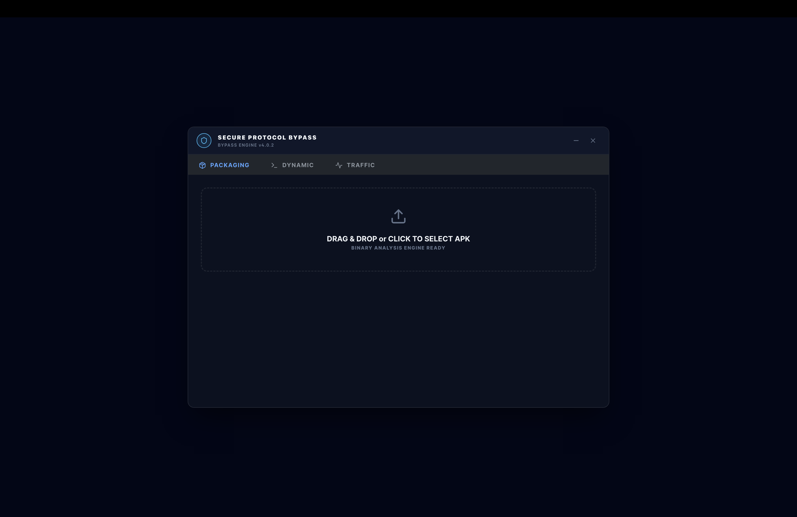
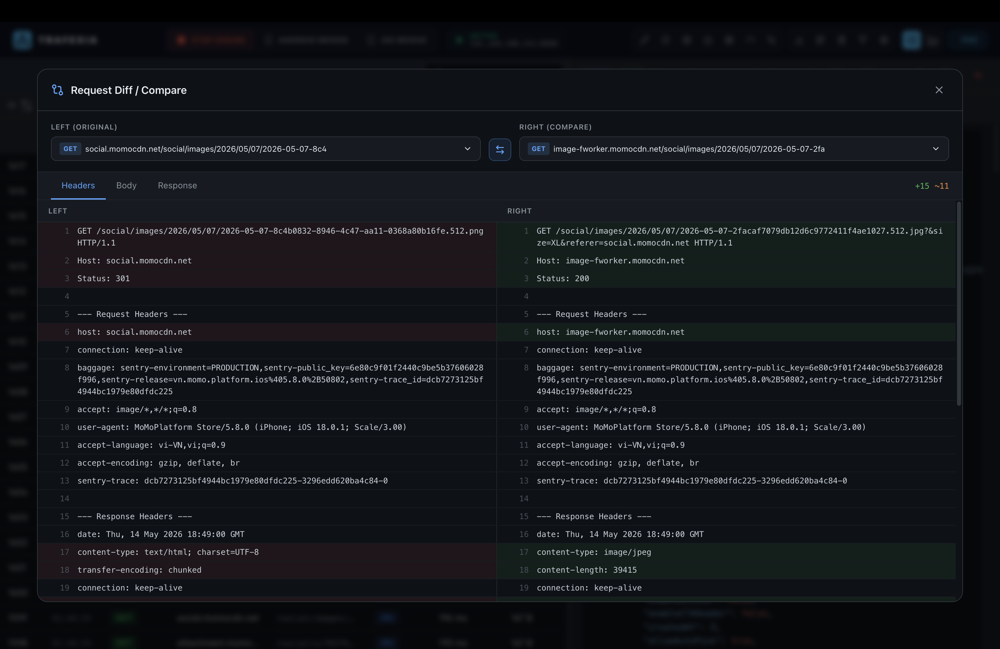
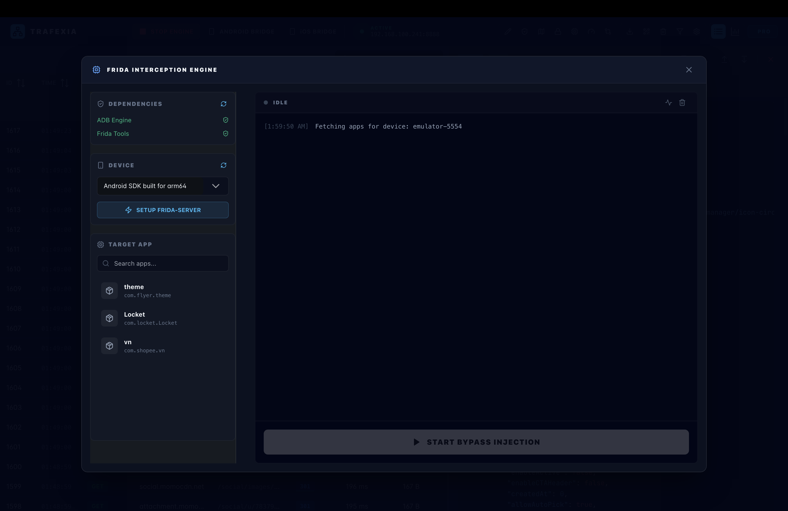
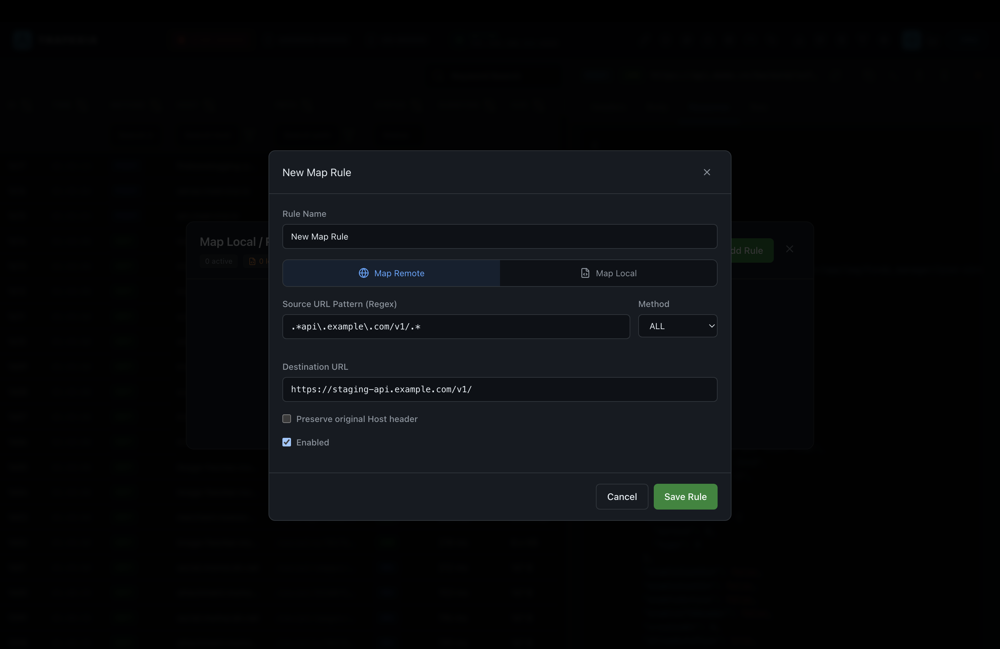
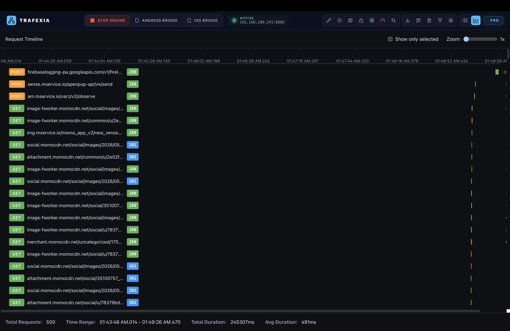
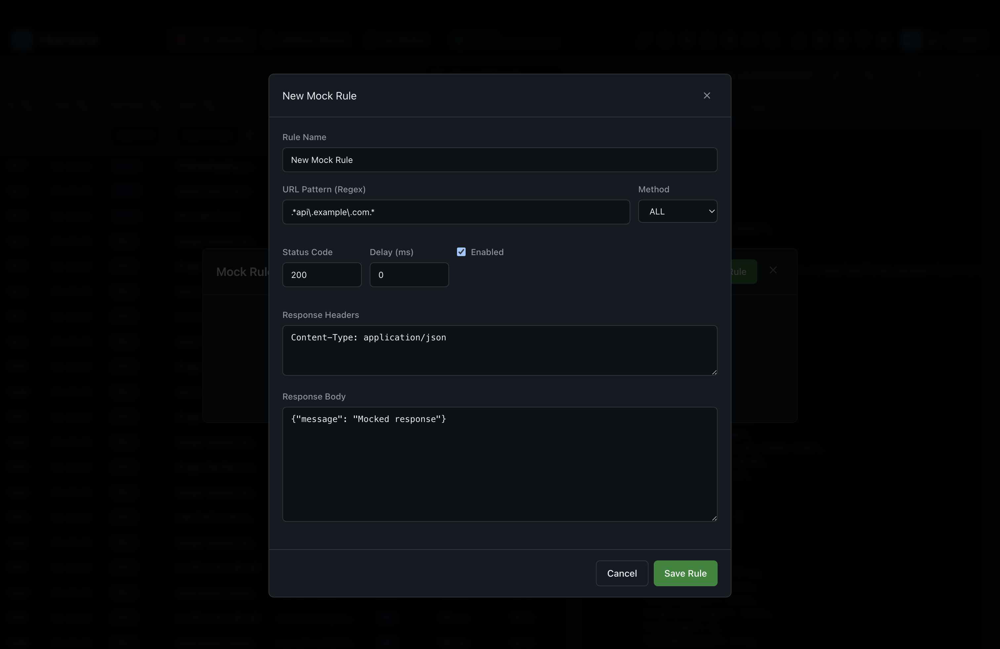

## 🙏 Credits

This project is based on **Trafexia - Mobile Traffic Interceptor** by Danieldev23.

Original repository:
https://github.com/danieldev23/trafexia

Thanks to the original author for creating and sharing this project.

---

# Trafexia - Mobile Traffic Interceptor

A powerful desktop application for intercepting, analyzing, and manipulating HTTP/HTTPS traffic from mobile devices. Built with Electron, Vue 3, and TypeScript.

Trafexia provides comprehensive tools for mobile app security testing, reverse engineering, and API debugging with advanced features like SSL pinning bypass, request mocking, traffic mapping, and more.

## ✨ Key Features

### 🔐 SSL/TLS Security Bypass

- **Built-in Bypass Scripts** - Supports OkHttp3, Conscrypt, WebView, Flutter, React Native, and more
- **APK Patching** - Inject bypass scripts directly into APKs without requiring rooted devices
- **Frida Gadget Integration** - Dynamic code injection using Frida for runtime hooking
- **Root & Emulator Evasion** - Advanced system hooks to bypass security constraints on highly-secure apps


_Secure Protocol Bypass with packaging, dynamic injection, and traffic options_


_Dynamic bypass injection with framework selection and live stream monitoring_

---

### 📊 Real-time Traffic Analysis

- **Live Request Capture** - Intercept and display HTTP/HTTPS requests in real-time
- **Request Timeline Visualization** - See request distribution and patterns over time
- **Advanced Filtering** - Filter by HTTP method, status code, host, URL path, and more
- **Request Comparison** - Side-by-side diff view to compare original vs. modified requests


_Real-time request capture with detailed headers, body, and response analysis_


_Visual timeline showing request distribution and frequency_


_Side-by-side request comparison with header and response diff_

---

### 🎯 Request Manipulation

- **Request Mapping** - Map requests to different URLs with regex pattern support
- **Mock Responses** - Create mock responses with custom status codes, headers, and bodies
- **Request Composer** - Build and test custom HTTP requests
- **Throttling Control** - Simulate network conditions and bandwidth limitations


_Map requests to different destinations with regex patterns and method selection_


_Create mock responses with custom status codes, headers, and response bodies_

---

### 🔌 Frida Integration

- **Frida Interception Engine** - Runtime code hooking and manipulation
- **Device & Target App Selection** - Easy selection of target Android devices and applications
- **Live Stream Monitoring** - Monitor Frida server logs in real-time
- **Automated Setup** - One-click Frida server setup and injection


_Frida panel showing device selection, target apps, and live injection controls_

---

### 📋 Request Details & Export

- **Syntax Highlighting** - Color-coded JSON, XML, and HTML responses
- **Header Analysis** - View all request and response headers with values
- **Timing Information** - See request duration and response times
- **Export Options** - Export as HAR, cURL commands, Python code, or Postman collections
- **Pattern Detection** - Auto-detect and highlight JWT tokens, API keys, and Base64 strings

---

### 🌐 Mobile Setup

- **QR Code Configuration** - Simple QR code scanning for device setup
- **Auto Certificate Installation** - Automatic CA certificate management
- **Proxy Auto-Discovery** - Easy proxy configuration on Android and iOS
- **Multi-Device Support** - Handle multiple devices simultaneously

---

### 💾 Storage & History

- **Local Database** - SQLite database for traffic history
- **Request Filtering** - Search and filter through captured requests
- **Session Management** - Save and restore traffic sessions
- **Export to Popular Tools** - Direct export to Postman, cURL, Python

## 🛠️ Tech Stack

| Component                  | Technology                           |
| -------------------------- | ------------------------------------ |
| **Desktop Framework**      | Electron + Vite                      |
| **Frontend**               | Vue 3 (Composition API) + TypeScript |
| **Styling**                | TailwindCSS + PrimeVue               |
| **State Management**       | Pinia                                |
| **Database**               | Better-SQLite3                       |
| **Certificate Generation** | node-forge                           |
| **Reverse Engineering**    | Frida, APK Tools, Android SDK        |
| **Proxy**                  | Custom MITM implementation           |

---

## 🚀 Getting Started

### Prerequisites

- **Node.js** 18+ and npm/yarn
- **Android SDK** (for APK patching features)
- **Frida** (for dynamic injection - optional)
- **macOS/Windows/Linux**

### Installation

```bash
# Clone the repository
git clone https://github.com/tonynhox/trafexia-clone.git
cd trafexia-clone

# Install dependencies
npm install

# Start development server
npm run dev
```

The application will launch with hot reload enabled for development.

### Building for Production

```bash
# Build for current platform
npm run build

# Build for macOS (Intel)
npm run build:mac

# Build for macOS (Apple Silicon)
npm run build:mac-arm

# Build for Windows
npm run build:win

# Build for Linux
npm run build:linux
```

Executables will be generated in the `dist-electron/` folder.

> [!TIP]
> **🍎 macOS "App is damaged" Warning Fix:**
> Since this is a free, unsigned package, Google Chrome/macOS Gatekeeper will automatically quarantine it and show the error: _"Trafexia is damaged and can't be opened."_
> To fix this instantly, open your Terminal on macOS and run:
>
> ```bash
> xattr -cr /Applications/Trafexia.app
> ```
>
> _(Make sure you have dragged the Trafexia app into your `/Applications` directory first)._

---

## 📖 Usage Guide

### Quick Start

1. **Launch Trafexia** - Open the application
2. **Start the Proxy** - Click the "Start Proxy" button to begin intercepting traffic
3. **Configure Mobile Device** - Scan the QR code or manually configure proxy settings
4. **Install CA Certificate** - Follow the setup instructions for your platform
5. **Capture Traffic** - All HTTP/HTTPS traffic will be captured and displayed

### Android Setup Guide

#### Step 1: Configure Proxy

1. Open **Settings** → **WiFi**
2. Long-press on your network and select **Modify**
3. Tap **Advanced options**
4. Set **Proxy** to **Manual**
5. Enter the **Proxy IP** and **Port** (displayed in Trafexia)
6. Tap **Save**

#### Step 2: Install CA Certificate

1. Download the CA certificate from Trafexia (QR code or manual link)
2. Open **Settings** → **Security**
3. Tap **Install from storage**
4. Select the downloaded certificate file
5. Follow the prompts to complete installation

#### Step 3: Use SSL Bypass (Optional)

For apps with SSL pinning:

1. In Trafexia, go to **SSL Bypass** tab
2. Select **Android** and target device
3. Choose your **target app** or use **APK Patcher**
4. Click **Inject Bypass Script** or **Patch APK**
5. Follow the on-screen instructions

### iOS Setup Guide

#### Step 1: Configure Proxy

1. Open **Settings** → **WiFi**
2. Tap the **(i)** icon next to your network
3. Scroll down to **Configure Proxy**
4. Select **Manual**
5. Enter the **Proxy IP** and **Port**
6. Tap **Done**

#### Step 2: Install CA Certificate

1. Download the CA certificate using the link provided in Trafexia
2. Open **Settings** → **General** → **Profiles**
3. Tap **Install** to install the profile
4. Go to **Settings** → **General** → **About** → **Certificate Trust Settings**
5. Enable the Trafexia CA certificate

#### Step 3: Trust the Certificate

1. Go to **Settings** → **General** → **About**
2. Look for certificate trust settings
3. Enable full trust for the Trafexia certificate

### Traffic Analysis

**Capturing Requests:**

- All HTTP/HTTPS requests will appear in the request list
- Click on any request to view details
- Headers, body, and response tabs show detailed information

**Filtering & Searching:**

- Use the search bar to find specific requests
- Filter by method (GET, POST, etc.), status code, or host
- Color-coded status codes for quick identification

**Request Comparison:**

- Select two requests to compare side-by-side
- See the diff in headers and response bodies
- Useful for debugging API changes

### Request Manipulation

**Map Rules (URL Rewriting):**

1. Click **Map Rules** tab
2. Create a new rule with:
   - **Pattern**: Regex pattern to match (e.g., `.*api\.example\.com.*`)
   - **Method**: HTTP method filter (GET, POST, ALL)
   - **Destination**: New URL to redirect to
3. Enable/disable rules as needed

**Mock Responses:**

1. Click **Mock Rules** tab
2. Create a mock rule with:
   - **URL Pattern**: Regex pattern to match
   - **Status Code**: HTTP status (200, 404, 500, etc.)
   - **Response Headers**: Custom headers
   - **Response Body**: JSON, XML, or plain text response
3. Matching requests will receive the mocked response

**Request Throttling:**

- Open **Throttle Control**
- Set bandwidth limits and latency
- Simulate slow network conditions
- Useful for testing app performance on poor connections

### Frida Injection

1. Ensure **Frida server** is installed on your Android device
2. Open **Frida Interception Engine** tab
3. Click **Setup Frida Server**
4. Select your device from the list
5. Choose target application
6. Click **Start Bypass Injection**
7. View logs in the live stream panel

---

## 🔒 Security & Privacy

⚠️ **Important Security Notice:**

- Installing a CA certificate allows traffic interception on your device
- **Only use this tool for development and testing on your own devices**
- **Never use this on production devices or without explicit permission**
- Remove the CA certificate when you're done testing
- Do not use this tool for:
  - Intercepting others' traffic
  - Bypassing security on apps you don't own
  - Any illegal or unauthorized activities

---

## 🤝 Contributing

Contributions are welcome! Please feel free to submit a Pull Request.

```bash
# Clone and setup development environment
git clone https://github.com/tonynhox/trafexia-clone.git
cd trafexia-clone
npm install
npm run dev

# Make your changes and test thoroughly
npm run build
```

---

## 📄 License

This project is licensed under the **Trafexia Source-Available License** - see the [LICENSE](LICENSE) file for details.

The tool is provided for educational and authorized testing purposes only. Users are responsible for compliance with local laws and regulations.

---

## ❓ FAQ

**Q: Do I need a rooted/jailbroken device?**
A: No! Trafexia can patch APKs and inject scripts without requiring root access. However, Frida injection requires a rooted device.

**Q: Can I use this on apps with certificate pinning?**
A: Yes! That's one of the main features. Use either APK patching or Frida injection for dynamic bypass.

**Q: Is this legal?**
A: Yes, for testing on your own devices and authorized applications. Always respect app terms of service and local laws.

**Q: Can I export captured traffic?**
A: Yes! Export as HAR, cURL, Python, or Postman collections.

**Q: Does it work on iOS apps?**
A: iOS setup works for proxy interception. APK patching is Android-only, but you can use Frida on jailbroken iOS devices.
